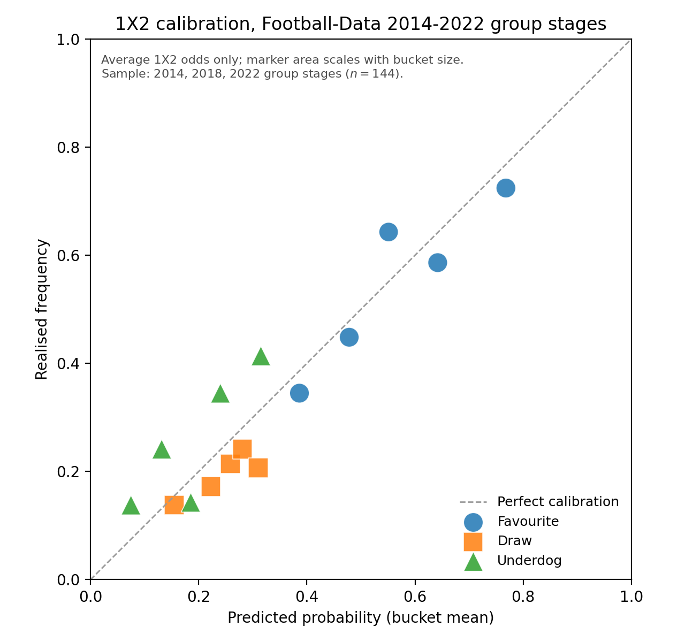
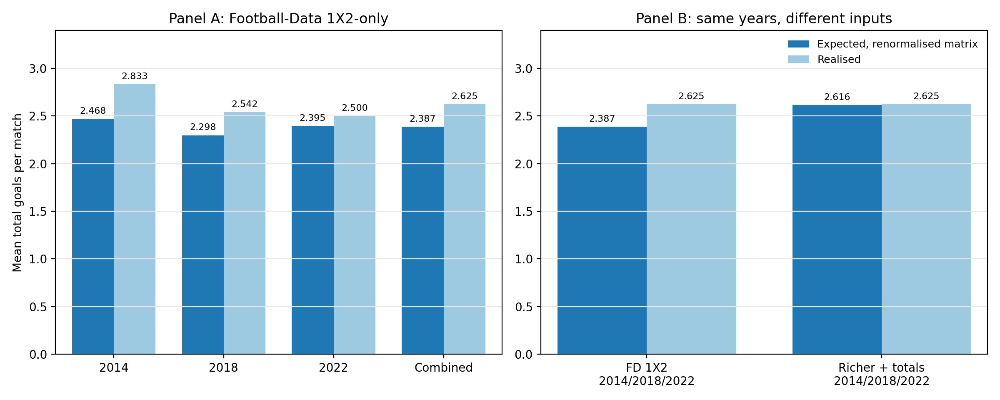
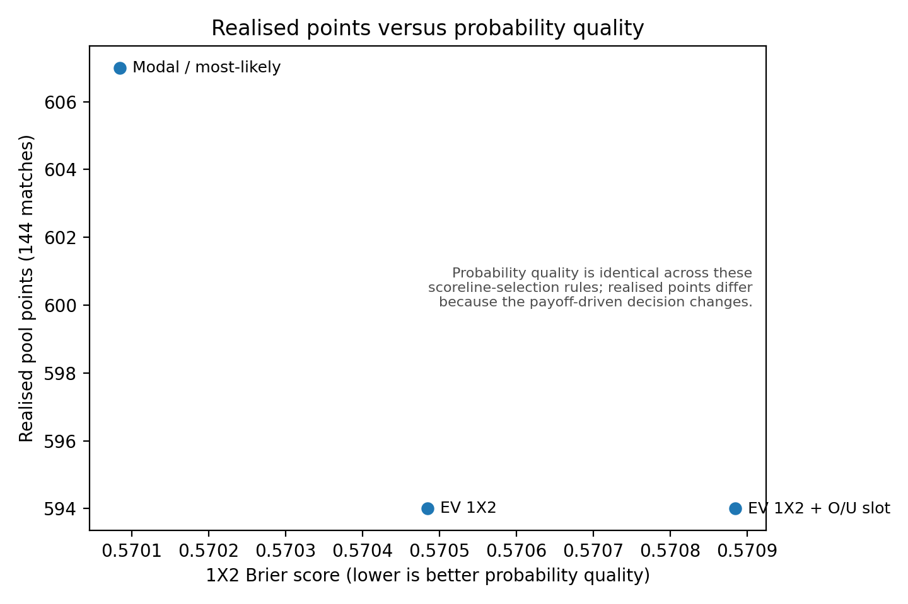
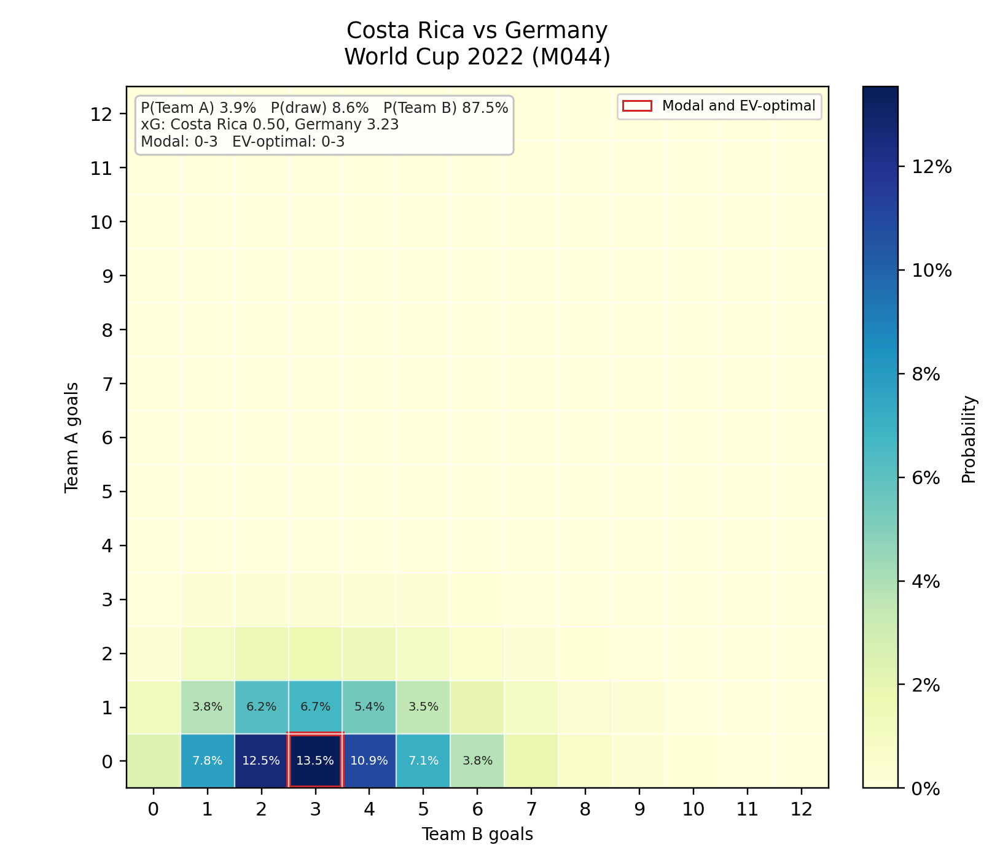
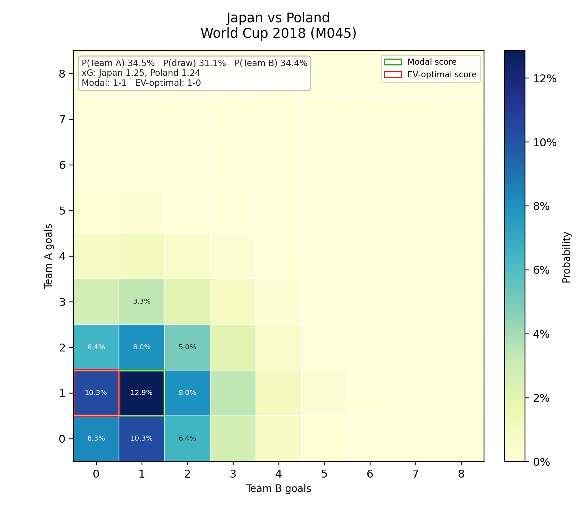

# WC Predictor

## What The Project Does

`wc-predictor` turns pasted OddsPortal football markets into World Cup
prediction-pool score recommendations. The live workflow parses a schedule,
splits one combined odds file per match, runs the established EV recommendation
logic, and writes a submission sheet plus a detailed diagnostics workbook.

The default live recommendation remains the existing pure-EV model. Research
diagnostics can challenge or explain a pick, but they do not silently change the
default submitted score.
The live margin-removal default is `normalised_inverse_odds`; Shin remains
available as an explicit research diagnostic.

## Quick Start / Matchday Use

1. Open `scripts/run_live_prediction.py`.
2. Keep `RUN_PROFILE = "live"` and `TERMINAL_VERBOSITY = "compact"`.
3. Set `RUN_MODE = "list_date"` and `DATE = "14-6"`.
4. Press **Run Python File** to see the game numbers.
5. Paste fresh odds into `input/odds/Mxxx.txt`.
6. Set `RUN_MODE = "single_match"`, keep `DATE`, and set `GAME_NUMBER`.
7. Press **Run Python File** again.
8. Read the `Final recommendations` block.

For the full step-by-step version, see
[docs/matchday_workflow.md](docs/matchday_workflow.md).

## Input Files

Create the schedule locally:

```text
input/schedule.txt
```

Create one odds file per match:

```text
input/odds/M008.txt
```

Use the tracked template:

```text
templates/odds_input_template.txt
```

The expected sections are:

```text
### MATCH
Team A vs Team B

### 1X2
<paste OddsPortal 1X2 table here>

### OVER_UNDER
<paste OddsPortal totals table here>

### BTTS
<paste OddsPortal BTTS table here>

### CORRECT_SCORE
<paste OddsPortal correct-score table here>

### ASIAN_HANDICAP
<optional: paste OddsPortal Asian handicap table here>
```

Live schedule and odds files are ignored by Git. Keep real tournament inputs in
`input/`, not in `data/raw/`.

Asian handicap is optional. When supplied, it is used by the
market-consistent challenger and diagnostics to improve goal-difference and
blowout-tail information; it does not override the default EV recommendation
automatically. The full ladder is parsed for diagnostics, while only a stable
near-money subset is used as market-consistent constraints. Orientation
warnings are diagnostic checks against reversed pasted team order. The market
roles are:

| Market | Main scoring information |
| --- | --- |
| 1X2 | Result tier |
| Correct score | Exact-score tier |
| Asian handicap | Goal-difference distribution |
| O/U totals | Total-goals environment |
| BTTS | Scoring dependence |

## Running From VS Code

The intended interface is the `USER SETTINGS` block in:

```text
scripts/run_live_prediction.py
```

Use these modes:

```python
RUN_MODE = "list_date"      # list games on DATE and exit
RUN_MODE = "single_match"   # run DATE + GAME_NUMBER
RUN_MODE = "date"           # run every game on DATE
RUN_MODE = "all_available"  # run every odds file in input/odds/
```

Command-line overrides still work for advanced use:

```powershell
python scripts/run_live_prediction.py --date 14-6 --game-number 3
python scripts/run_live_prediction.py --run-profile research --terminal-verbosity debug
```

## Output Files

Normal live outputs:

| Path | Purpose |
| --- | --- |
| `output/submission_sheet.xlsx` | Entry-ready recommendation sheet |
| `output/predictions.xlsx` | Detailed prediction and diagnostic workbook |
| `output/predictions.csv` | Machine-readable detailed recommendations |
| `output/parse_reports/` | Schedule and odds parser diagnostics |

Generated parser intermediates are written below `cache/`.

## Interpreting Results

`final recommendation` is the default score to submit.

`confidence` is a practical robustness label. High means the model is relatively
clear; medium means there is a reasonable alternative nearby; low or clustered
needs manual inspection.

`manual review` tells you whether to inspect the Excel files before submitting.
When it says `no`, the compact terminal output is usually enough.

`alternatives` show the main nearby score to consider if a match is flagged for
review.

Pattern flags are diagnostic-only. The WC 2022 group-stage review suggested the
main live risk is decision-rule fragility under the `10/7/5/1` scoring rule, not
a broad probability calibration failure. In particular, BTTS was not materially
under-calibrated in that sample, so broad BTTS warnings are not treated as a
reason to change the default score.

The current manual-review flags are:

- `draw_prone_flag`: low model `expected_total_goals` plus balanced favourite probability.
- `btts_conflict_flag`: narrow only; no-BTTS EV pick, elevated BTTS probability,
  balanced/draw-prone context, and a close BTTS-compatible alternative.
- `blowout_risk_flag`: strong favourite plus high total-goals signal, used to
  surface higher-margin alternatives.

All of these leave `recommended_score` unchanged.

## Validation Highlights

Validation runs over the **same 144 group-stage matches** (2014, 2018, 2022; 48
each) through two layers that differ only in their market inputs:

- The **richer layer** (headline) uses the full set of manually collected
  OddsPortal markets (1X2, totals, BTTS, correct score, Asian handicap) through
  the complete live pipeline and all challengers. With 2014 OddsPortal odds now
  collected, it covers all three tournaments (previously 2018/2022 only).
- The **1X2-only contrast layer** restricts inputs to Football-Data average 1X2
  odds (`H-Avg`, `D-Avg`, `A-Avg`) over the same 144 matches, with realised
  scores from `HGFT`/`AGFT`. It is a deliberately degraded control: it isolates
  the decision-rule effect (modal and EV act on identical probabilities) and
  quantifies what the extra markets add. The Football-Data workbook has no 2010
  sheet, so the control covers 144 matches, not 192. Asian-handicap,
  correct-score, and MC+AH logic is not applied in this layer.

Two metric families are reported:

- **Realised pool points** evaluate the *decision rule* under the Sporza
  `10/7/5/1` scoring system.
- **Probabilistic scoring rules** evaluate the *quality and calibration of the
  1X2-implied scoreline probability distribution*, independently of the
  discrete payoff (reported on the 1X2-only contrast layer).

Realised pool points (1X2-only contrast layer; modal and EV act on identical
probabilities here, so this isolates the decision rule):

| Strategy | 2014 | 2018 | 2022 | Combined |
|---|---:|---:|---:|---:|
| `most_likely_poisson` | 190 | 227 | 190 | 607 |
| `ev_optimal_1x2` | 193 | 222 | 179 | 594 |

An over/under-aware EV variant (`ev_optimal_1x2_over_under`) was also run; with no
totals market in the 1X2-only inputs it reduces exactly to `ev_optimal_1x2`
(same 193/222/179/594), so it is not listed as a separate row.

Modal-versus-EV decision divergence, over the same 144 matches under each input set:

| Sample | Matches | Modal = EV | Modal differs from EV | Divergence |
|---|---:|---:|---:|---:|
| 2014 1X2-only | 48 | 33 | 15 | 31.3% |
| 2018 1X2-only | 48 | 43 | 5 | 10.4% |
| 2022 1X2-only | 48 | 40 | 8 | 16.7% |
| 2014/2018/2022 1X2-only | 144 | 116 | 28 | 19.4% |
| 2014 richer layer | 48 | 23 | 25 | 52.1% |
| 2018 richer layer | 48 | 34 | 14 | 29.2% |
| 2022 richer layer | 48 | 36 | 12 | 25.0% |
| 2014/2018/2022 richer layer | 144 | 93 | 51 | 35.4% |

This measures how often the expected-points decision rule selects a different
scoreline from the modal scoreline; it does not show that EV empirically
dominates modal picks in realised points. The richer inputs move the EV pick off
the mode more often (most strongly in 2014).

Probabilistic validation:

| Sample | Matches | Brier | Log loss | RPS |
|---|---:|---:|---:|---:|
| 2014 | 48 | 0.563 | 0.951 | 0.135 |
| 2018 | 48 | 0.547 | 0.931 | 0.131 |
| 2022 | 48 | 0.601 | 1.032 | 0.149 |
| Combined | 144 | 0.570 | 0.971 | 0.138 |

The 1X2-only score matrix is somewhat conservative on total goals. Using the
renormalised score matrix expectation `sum(pi[a,b] * (a + b))`, the combined
mean expected total is 2.387 versus 2.625 realised, a +0.238 realised-minus-model
gap, about 10.0% relative to the model expectation. The same reduced-input
diagnostic is mildly draw-heavy: mean implied draw probability is 0.245 versus
0.194 realised draw frequency. This is treated as a limitation of inferring a
full scoreline distribution from 1X2 odds alone, not as a failure of the
expected-points decision rule. The expected-goals figure therefore uses two
panels: the full 2014/2018/2022 1X2-only contrast layer, and an apples-to-apples
comparison over the same 144 matches across validation layers. On that matched
set, the 1X2-only layer is 2.387 expected versus 2.625 realised (gap +0.238);
the richer OddsPortal layer with explicit total-goals inputs is 2.616 expected
versus 2.625 realised (gap +0.009). The richer layer almost exactly matches
realised total-goal intensity, so the 1X2-only gap is reduced-input information
loss rather than a general failure of the score-matrix idea.

The modal strategy scores higher than the EV-optimal strategy in realised
points over this specific 144-match sample. That does not change the model
policy: EV remains the ex-ante expected-points rule under the scoring function,
while modal remains a manual-review challenger. The probability vectors are the
same across these strategies, so realised-points differences arise from the
scoreline-selection layer rather than materially different probability
estimates.

A paired bootstrap confirms the gap is within noise: the 95% confidence interval
on the modal-minus-EV difference is `[-25, +56]` points over the 144 matches (it
contains zero). Reproduce it with `python scripts/compute_modal_ev_bootstrap.py`,
which pairs per-match realised points from
`output/research/world_cup_backtest_predictions.csv` and writes
`output/research/modal_ev_bootstrap_summary.csv`.

Headline richer challenger layer over the full 2014/2018/2022 group stage (n=144):

| Strategy / diagnostic | Points | Governance interpretation |
|---|---:|---|
| EV-optimal default | 576 | Live default benchmark |
| Modal / most-likely | 589 | Manual-review challenger; gain is 2022-only and high variance |
| Market-consistent + AH (raw) | 596 | Raw diagnostic, MC+AH on every match; highest total and positive in all three tournaments, but optimiser never fully converges |
| Gated MC+AH policy | 587 | Implemented rule: MC+AH only when fit acceptable, else EV default |
| Correct-score blend sweep | 589 | Best tested blend-weight diagnostic; mildly positive, research-only |
| Power devig | 571 | Underperforms in every tournament; not for serious live use |
| Dixon-Coles / larger grid | 576 | Inert relative to default on this combined layer |

These rows use the full live pipeline with all additional betting markets across
2014/2018/2022. Per-tournament totals (2014/2018/2022): EV `185/211/180`, raw
MC+AH `197/217/182`, gated MC+AH `192/215/180`, modal `177/197/215`. The
correct-score row is the best tested blend weight (`0.5`; the `0.75` and `0.85`
weights each scored 587). The raw MC+AH row uses MC+AH on every match; the gated
MC+AH row is the actually-implemented policy, adopting MC+AH only on the 110/144
matches with an acceptable optimiser fit (33 severe, 1 poor) and falling back to
EV otherwise. The gated policy scores 587 — above EV (576), below the raw
diagnostic (596), and within sampling noise — so MC+AH stays a gated challenger,
not a promoted default. These rows inform challenger governance only and do not
establish betting alpha.

Figures (generated by `scripts/generate_validation_figures.py` into
`paper/figures/`):







### Exact-score probability matrices

Each prediction starts from a full scoreline probability matrix: home/team-A
goals on the vertical axis, away/team-B goals on the horizontal axis, and colour
as the probability of that exact score. The heatmaps below show the contrast
between an extreme-favourite match and a genuinely balanced historical match.





The EV-optimal score is chosen under the `10/7/5/1` payoff rule, so it is a
function of exact-score, goal-difference, and result probabilities. It can
therefore differ from the modal scoreline even when both come from the same
matrix.

Regenerate them with:

```bash
python scripts/generate_validation_figures.py
python scripts/generate_probability_matrix_figures.py
```

## Research Mode / Advanced Diagnostics

Use research mode when you want slower diagnostic workbooks and fuller terminal
detail:

```python
RUN_PROFILE = "research"
TERMINAL_VERBOSITY = "debug"
```

Research mode enables margin-method comparison, market-consistent challenger
diagnostics, and correct-score weight sensitivity. These are for investigation;
they do not change the default live recommendation by themselves.

The historical live backtest has an additional `BACKTEST_PROFILE = "research"`
mode with correct-score blend-weight sweeps, modal/draw threshold sweeps, and a
larger-grid configuration. Correct-score blend value remains a mild, unproven
diagnostic across the 2014/2018/2022 richer sweep and is not promoted to the live
default.
It also exports probability-quality validation alongside realised pool points:
`probabilistic_backtest_summary.csv`, `calibration_1x2.csv`,
`calibration_btts.csv`, `calibration_totals.csv`, and
`scoreline_probability_diagnostics.csv`. These use Brier score, clipped log
loss, RPS, calibration buckets, expected-total-goals errors, and actual
score/result/margin probability diagnostics.
Local live-paste historical folders follow `input/historical/wc2014/`,
`input/historical/wc2018/`, and `input/historical/wc2022/`, each with manually
collected OddsPortal pastes for all 48 group-stage matches.

Public strategy remains diagnostic. Use `PUBLIC_STRATEGY_TARGET` /
`public_strategy_target` values such as `friends`, `balanced`, or `national`
to scale crowding/decorrelation diagnostics for different field sizes; pure
expected-points optimisation stays the default score.

Additional research diagnostics include optional Shin margin removal,
market-estimated Dixon-Coles rho from low correct-score cells, and a historical
World Cup backtest harness.

Current 2026 policy after the 144-match richer validation and its 1X2-only
contrast layer:

- EV remains the live default; diagnostics do not override `recommended_score`.
- In the 1X2-only contrast layer, modal/most-likely scores higher than the
  EV-optimal strategy over the specific 144-match realised-points sample, but
  this is within noise and not robust enough to promote over the ex-ante
  expected-points rule.
- In the richer 144-match layer, raw MC+AH posts the top total (596) and beats EV
  in all three tournaments. The actually-implemented gated policy (MC+AH only on
  acceptable-fit matches, else EV) scores 587 — still above EV (576) but within
  sampling noise and dependent on a non-converging optimiser, so MC+AH stays a
  gated challenger rather than the default.
- Do not promote modal/most-likely, MC+AH, correct-score blend-weight changes,
  power devig, global draw boosts, or AH favourite-under-cover adjustments to
  the live default.
- Modal/draw is manual-review only, not a default strategy.
- Correct-score blending remains research; keep the live default weight unchanged.
- MC+AH is a gated challenger: inspect it only when optimiser fit is acceptable.
- Real quoted AH main-line under-cover evidence is weak and monitor-only.
- Round-3 favourite fade and narrowed BTTS conflict are review notes, not alternative-pick rules.
- Power devig should not be used for serious live decisions.
- Dixon-Coles and larger-grid diagnostics are retained, but were inert on the combined group-stage backtest.
- Use `expected_total_goals` for draw-prone/high-total diagnostics. The old
  `ou_median_total` compatibility alias is only an O/U ladder median, not an
  expected-goals estimate.
- Realised pool points evaluate the contest decision. Proper scoring rules and
  calibration evaluate probability quality. Both are needed because realised
  points are high variance even at the current 144-match combined sample.

An opt-in advanced modelling layer is also available, all diagnostic-first and
off by default (see [docs/mathematical_basis.md](docs/mathematical_basis.md)):

- **Market-type-specific devig** via `DEVIG_PROFILE = "market_specific"` in
  `scripts/run_live_prediction.py`, or `ProjectConfig(devig=DevigConfig(...))`.
  Aggressive methods can be used on 1X2/BTTS/O/U/Asian handicap while
  correct-score markets stay on normalised inverse odds with safe fallback.
- **Dynamic larger grid** for extreme favourites (`dynamic_grid_enabled`,
  `extreme_favourite_max_goals`) to quantify hidden score-grid tail mass.
- **Dixon-Coles / bivariate-Poisson priors** for the market-consistent KL
  projection (`market_consistent_prior`), and a standalone bivariate challenger
  (`enable_bivariate_poisson_diagnostic`).
- **Skellam margin model** fitted to Asian-handicap lines
  (`enable_asian_handicap_margin_model`).
- **Group-level constraint weights** (`MarketConsistentGroupWeights`) and a
  constraint correlation / double-counting diagnostic note.

None of these change the default live recommendation unless explicitly enabled.

To run the historical harness, create a legally safe local CSV from:

```text
templates/historical_world_cup_matches_template.csv
```

Then run:

```powershell
python scripts/run_historical_world_cup_backtest.py --input input/historical/2022/world_cup_matches.csv
```

For the extended Football-Data World Cup workbook path, place the downloaded
`World Cup XLSX NEW` file somewhere local such as:

```text
input/historical/football-data/world-cup.xlsx
```

Then run the common 1X2-market validation across the available group-stage
sheets:

```powershell
python scripts/run_historical_world_cup_backtest.py `
  --football-data-xlsx input/historical/football-data/world-cup.xlsx `
  --years 2014 2018 2022 `
  --odds-source avg
```

This mode uses `H-Avg`, `D-Avg`, and `A-Avg` by default because average odds
are a better consensus-market input than max odds. If average odds are missing
for a row, Bet365 1X2 odds are used as an explicit fallback and reported. In
the available workbook, the 2014/2018/2022 sheets each load 48 group-stage
matches, all loaded rows have valid `H-Avg`/`D-Avg`/`A-Avg`, and no Bet365
fallback rows are used. There is no 2010 sheet in that workbook, so the
extended validation covers 144 matches, not 192.

This extension is intentionally limited to the common 1X2 input: it reconstructs
an independent-Poisson score matrix, compares modal versus EV-optimal
scorelines, scores realised pool points using `HGFT`/`AGFT`, and exports 1X2
probability-quality summaries. It does not force Asian handicap, correct-score
blend, or MC+AH diagnostics onto tournaments where comparable inputs are not
available, and it does not establish betting alpha.

No real historical odds are tracked in the repository. Historical odds quality,
timing, and coverage matter, so treat results as validation evidence rather
than proof that a challenger should become the live default.
Shin can fail on sparse, low-overround, or unusually high-overround markets;
live processing falls back to `normalised_inverse_odds` for that market and
records a warning rather than trusting invalid probabilities.

Longer technical notes live in:

- [docs/mathematical_basis.md](docs/mathematical_basis.md)
- [docs/model_roadmap.md](docs/model_roadmap.md)
- [docs/odds_collection_strategy.md](docs/odds_collection_strategy.md)
- [docs/backtesting.md](docs/backtesting.md)
- [docs/knockout_scoring_verification.md](docs/knockout_scoring_verification.md)

## Project Structure

```text
input/                   local live schedule and odds files
templates/               tracked paste templates
output/                  generated reports
cache/                   generated parser intermediates
src/wc_predictor/        package code
scripts/                 live, debugging, and research entry points
tests/fixtures/          tracked parser fixtures
docs/                    workflow and methodology notes
```

## Install And Test

```powershell
python -m venv .venv
.\.venv\Scripts\Activate.ps1
python -m pip install -e ".[dev]"
.\.venv\Scripts\python.exe -m pytest -q
```

Useful test commands:

```powershell
.\.venv\Scripts\python.exe -m pytest -q -m "not slow"
.\.venv\Scripts\python.exe -m pytest -q
```

Quick combined historical smoke run:

```powershell
.\.venv\Scripts\python.exe scripts\run_live_backtest.py
```

With the checked-in runner defaults this uses the combined `wc2014` + `wc2018` +
`wc2022` folders, `BACKTEST_PROFILE = "quick"`, `EXPORT_CSV_ONLY = True`, and
`SHOW_PROGRESS = False`.
